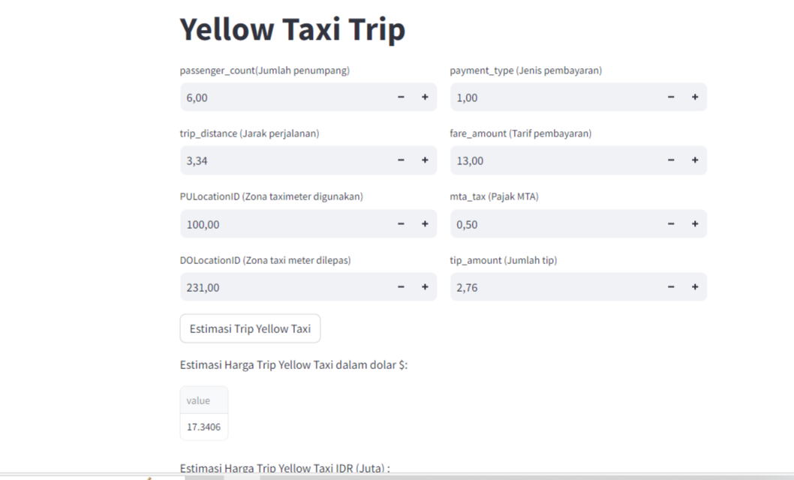

# Laporan Proyek Machine Learning
### Nama    : Shiva Amalia Setiawan
### Nim     : 211351139
### Kelas   : Teknik Informatika Pagi A

## Domain Proyek

Trip Taxi Kuning atau Yellow Taxi Trip di New York City dimana data ini dapat digunakan sebagai gambaran bagi semua orang yang ingin berlibur ke New York dan ingin mengetahui berapa jumlah serta harga yang dimiliki oleh Taxi kuning atau Yellow Taxi saat akan atau ingin menggunakannya.

## Business Understanding

Untuk memudahkan seseorang melihat kisaran harga Taxi yang akan dinaiki saat berkunjung ke New York City dengan menggunkan teknologi, termasuk aplikasi seluler, platform pemesanan online, dan sistem pelacakan untuk menghubungkan penumpang dengan pengemudi.

Bagian laporan ini mencakup :

### Problem Statements

Mengidentifikasi untuk meningkatkan efisiensi dan kenyamanan layanan taksi dalam perjalanan kota. Banyak penumpang mengalami kesulitan dalam memesan taksi, menilai pengemudi, dan membayar. Selain itu, pengemudi taksi juga sering mengalami tantangan dalam mengelola jadwal dan menerima pesanan.

### Goals

Kemudahan dan kenyamanan untuk penumpang maupun pengemudi untuk menentukan serta memperhitungkan jarak sesuai harga yang akan dikunjungi dengan menggunakan Taxi Kuning.


### Solution statements

- Mengembangkan platform Estimasi harga Trip Yellow Taxi yang terintegrasi dengan Kaggle.com guna memberikan akses yang cepat dan mudah tentang informasi kisaran harga saat menaiki Taxi Kuning di New York. platform ini menyediakan antarmuka yang mudah dimana kita bisa menaiki Taxi dengan aman dan mudah dengan sebuah paltform online tersebut, selain itu juga dengan adanya platform online ini kita bisa mengetahui Jarak perjalanan, Zona Taxi, Jenis pembayaran, jumlah tip, serta total keseluruhan yang akan dikeluarkan pada saat menggunakan Taxi ini. Dengan solusi ini, kami bertujuan untuk menciptakan pengalaman perjalanan yang lebih baik bagi penumpang dan membantu pengemudi dalam meningkatkan pendapatan mereka.

- Model yang dihasilkan dari dataset ini menggunakan metode LinearRegression.

## Data Understanding

Data yang digunakan yaitu Datasets yang berasal dari Kaggle dimana pada Kaggle ini memiliki sekumpulan data tentang Trip Taxi Kuning, didalam datasets tersebut memiliki 22699 data.

[Trip Yellow Taxi](https://www.kaggle.com/datasets/yakhyojon/automatidata)


### Variabel-variabel pada Heart Failure Prediction Dataset adalah sebagai berikut:

- Passenger_count (Jumblah penumpang) (Number, int64) = Jumlah penumpang di dalam kendaraan. Ini adalah nilai yang dimasukkan oleh pengemudi. 
- Trip_distance ( Jarak_perjalanan) (float64)= Jarak perjalanan yang telah dilalui dalam mil yang dilaporkan oleh taksimeter.
- PULocationID (number int64) = Zona Taksi TLC di mana taksimeter digunakan.
-  DOLocationID (number int64)= Zona Taksi TLC DOLocationID TLC di mana taksimeter dilepaskan.
- Payment_type (Jenis_pembayaran) (number int64) =  Kode numerik yang menandakan cara penumpang membayar perjalanan. 1= Kartu kredit 2= Tunai 3= Tanpa biaya 4= Sengketa 5= Tidak diketahui 6= Perjalanan dibatalkan.
- Fare_amount (Tarif_jumlah)(float64) = Tarif waktu dan jarak yang dihitung oleh meteran.
- MTA_tax  (Pajak MTA) (float64) = yang secara otomatis dipicu berdasarkan tarif meteran yang digunakan.
- Tip_amount (Jumlah_Tip) (float64) =  Kolom ini secara otomatis diisi untuk tip kartu kredit. Tip tunai tidak termasuk.
- Total_amount (Jumlah_Total) (float64)=  Jumlah total yang dibebankan kepada penumpang, tidak termasuk tip tunai.

## Data Preparation
### Data Collection

Data collection ini saya dapat dari dataset yang nantinya digunakan dari website kaggle dengan nama dataset New York City Taxi and Limousine Fare dengan file 2017_Yellow_Taxi_Trip.csv.

### Data Discovery And Profiling

Pada bagian ini kita menggunkan teknik EDA.

Pertama kita import library yang dibutuhkan,

```jupiter
import pandas as pd
import numpy as np
import matplotlib.pyplot as plt
import seaborn as sns
from sklearn.model_selection import train_test_split
from sklearn.linear_model import LinearRegression
```

Karena saya menggunakan VSCode dalam pembuatannya, maka selanjutnya mari kita create dataset yang sudah kita download dari web kaggle.com

```jupiter
df = pd.read_csv('2017_Yellow_Taxi_Trip_Data.csv')
```

Setelah itu mari kita lihat dataset kita,
```jupiter
df.head()
```
karena ada dataset yang bersifat string maka dari itu saya ingin mengubah salah satu kolom menjadi Number,

```jupiter
name_of_col = ['store_and_fwd_flag']
for i in range(len(name_of_col)) :
    df[name_of_col[i]]= df[name_of_col[i]].map({'N':0,'Y':1}).astype(int)
```

Lalu Karena kolom yang tidak saya inginkan maka dari itu, saya menghapus kolom terlebih dahulu

```jupiter
df.drop(['tpep_pickup_datetime','tpep_dropoff_datetime'], axis=1, inplace=True)
```

selanjutnya mari kita lihat datasetnya terdapat baris yang kosong atau null dengan menggunakan seaborn,

```jupiter
sns.heatmap(df.isnull())
```


Amaannnn!!

setelah itu mari kita lanjut dengan data exploration kita,
```jupiter
plt.figure(figsize=(20,8))
sns.heatmap(df.corr(),annot=True)
```


Setelah itu mari kita lihat data trip distance dengan menggunakan grafik, 

```jupiter
trip_distanc = df.groupby('trip_distance').count()[['mta_tax']].sort_values(by='mta_tax',ascending=True).reset_index()
trip_distanc = trip_distanc.rename(columns={'mta_tax':'fare_amount'})
```
```jupiter
fig = plt.figure(figsize=(15,5))
sns.barplot(x=trip_distanc['trip_distance'], y=trip_distanc['fare_amount'],color='royalblue')
plt.xticks(rotation=60)
```


bisa dilihat bahwa jarak perjalanan saat menggunakan taxi sangat beragam, dimana banyak orang yang menggunakan Taxi dengan jarak dekat maupun jauh.

selanjutnya mari kita lihat pendapatan tip yang didapat oleh taxi 
```jupiter
plt.figure(figsize=(15,5))
sns.barplot(x=tip_amount['tip_amount'], y=tip_amount['count'], color='royalblue')
```


Mencari nilai distribusi PULocationID (Zona taximeter digunakan)
```jupiter
plt.figure(figsize=(15,5))
sns.distplot(df['PULocationID'])
```


Mencari nilai distribusi DOLocationID (Zona taximeter saat dilepas)

```jupiter
plt.figure(figsize=(15,5))
sns.distplot(df['DOLocationID'])
```

Setiap taksi yang beroperasi di dalam zona taxi meter dilengkapi dengan alat meter yang terpasang di dalam kendaraan. Zona taxi meter memungkinkan taksi untuk menghitung biaya perjalanan berdasarkan parameter tertentu, seperti jarak tempuh dibutuhkan. Hal ini memastikan bahwa penumpang hanya membayar sejumlah uang yang sesuai dengan perjalanan yang mereka lakukan.

## Modeling

Selanjutnya mari kita seleksi kolom-kolom fitur yang ada di dataset dan juga untuk kita tampilkan pada web,
```jupiter
features = ['passenger_count',	'trip_distance', 'PULocationID', 'DOLocationID', 'payment_type', 'fare_amount', 'mta_tax', 'tip_amount']
x = df[features]
y = df['total_amount']
x.shape, y.shape
```
Selanjutnya kita tentukan beberapa dataset yang akan diguakan untuk test dan untuk train,
```jupiter
from sklearn.model_selection import train_test_split
x_train, X_test, y_train, y_test = train_test_split(x,y,random_state=25)
y_test.shape
```
Setelah itu mari kita lanjutkan dengan membuat model LinearRegressionnya
```jupiter
from sklearn.linear_model import LinearRegression
lr = LinearRegression()
lr.fit(x_train,y_train)
pred = lr.predict(X_test)
y_test.shape
```
Setelah membuat LinearRegression mari kita lihat score dari model kita,
```jupiter
score = lr.score(X_test, y_test)
print('Akurasi Yellow Taxi = ', score)
```
0.9943508589679306
Wow, lumayan besar juga yaa!

Setelah itu mari kita export sebagai sav agar nanti bisa kita gunakan pada project web streamlit kita.
```jupiter
import pickle

filename = 'Taxi_Yellow.sav'
pickle.dump(lr,open(filename,'wb'))
```

## Evaluation

Pada evaluasi ini, saya menggunakan metode r_square. R-squared (R^2), adalah salah satu metrik evaluasi yang umum digunakan dalam machine learning untuk mengukur sejauh mana model regresi cocok dengan data yang diobservasi. R-squared mengukur seberapa baik model memahami variasi dalam data target. Metrik ini sangat umum digunakan dalam machine learning dan data science.

```jupiter
from sklearn.metrics import r2_score
data = pd.read_csv('2017_Yellow_Taxi_Trip_Data.csv')

features = ['passenger_count',	'trip_distance', 'PULocationID', 'PULocationID',	'DOLocationID',	'payment_type',	'fare_amount', 'mta_tax',	'tip_amount']
x = df[features]
y = df['total_amount']

x_train, X_test, y_train, y_test = train_test_split(x,y,random_state=25)

lr.fit(x_train, y_train)
predictions = lr.predict(X_test)

r_squared = r2_score(y_test, predictions)

print("R-squared :", r_squared)
```

## Deployment

[Streamlit-taxi](https://app-taxi.streamlit.app/)




